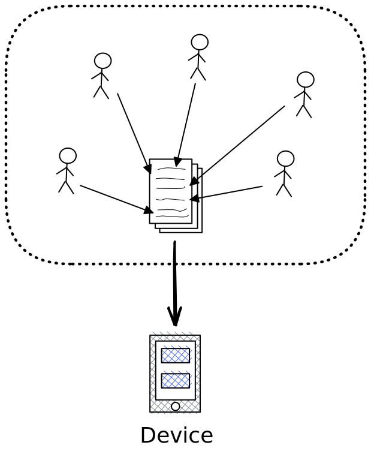
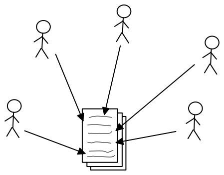

# Remote Collaboration

Working together on a group project when you're not physically together.

---

## Workshop Schedule

- Introductions

- Workshop Objectives

- Collaborative Coding --> Collaborative Writing

- Challenges in Collaborative Writing

- Tools for Collaborative Coding

  - _small group exercise_

- Group Stand-Ups & Discussion

- Recap

---

## Introductions

1. (_3 minutes_) Everyone go to ([a copy of this doc](https://docs.google.com/document/d/1D_sdSe8Fk2hnNwsickRkwwifwLkuZY9ZNuYHHDMLSL4/edit?usp=sharing)) and follow the instructions

2. (_30 sec. each_) Each person introduces themselves in the group call:
   - Read your introduction from the doc
   - Share your experience while writing your introduction

---

## Workshop Objectives

- You can explain how collaborative coding is like collaborative writing.

- You can list the basic challenges in a collaborative software/writing project.

- You can explain at least one tool/methodology that is used to address each challenge.

---

class: center

## Collaborative Coding

---

class: center

## Collaborative Writing

---

## Challenges in Collaborative Writing

- **Shared Understanding**
  - _Everyone in your group should have the same understanding of the project_
- **Communication**
  - _Clear and open channels of communication that **everyone uses**_
- **Task Division**
  - _Dividing the project into tasks that can be completed separately then reassembled_
- **Task Tracking**
  - _Having a reliable system for keeping track of progress through all the tasks_
- **Proofreading**
  - _Following workflows to proofread each other's work **before** it's reassembled_
- **Reassembling**
  - _Merging separate tasks into one project **without** breaking everything_
- **Conflicts**
  - _When two or more people try to change the same lines of text_
- **Backtracking**
  - _Going back to older versions when something breaks or the requirements change_

---

## Tools for Collaborative Coding

You will have _30 minutes_ in small groups to work on your group document, be sure to manage your time well!

- ([one copy of this doc per group](https://docs.google.com/document/d/1fNj_2Zpx-lwO20RMk-ztr2qEVZc-aoo-aBh-4ScGrEo/edit?usp=sharing))

---

## Group Stand-ups & Discussion

1. Each group presents their standup. (_1 minute per group, practice being succinct!_)

2. Full-group discussion

---

## Recap

- There are no quick wins for successful collaboration

- Just discipline, communication, planning and patience

- Tools and methodologies are helpful, but are not magic fixes

- The best collaboration strategy is the one that works for your group

- "Alone you go faster, together you go further"

> PS. Digital Project groups, we'll be in touch on Slack
