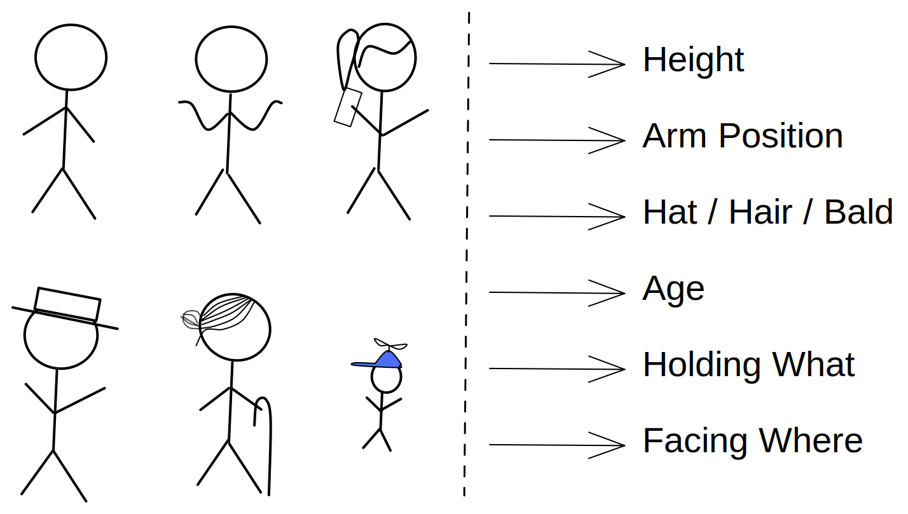

class: center

# Domain & Data

### Digital Projects

---

## Workshop Schedule

1. Group check-ins

2. Workshop objectives

3. Types of data & data sources

4. Potential problems with data

5. Group data investigations

   - _small group exercise_

6. Discussion

7. Next Steps

---

## Group Check-Ins

1. What problem are you addressing, or what question are you asking?

2. Why is this an interesting project?

3. Why do you think you can achieve this within your constraints?

---

## Workshop Objectives

- You can explain what it means to _model_ an aspect of the world using data.

- You can explain different types of data, and data sources.

- You understand that bad data will ruin your project.

- You understand several ways data can be bad.

- You can investigate a data set using the Discussion Questions.

---

## Modeling With Data

???

"Modeling" has a variety of meanings in DS, we're talking about when you collect data to create a simplified and scoped model of the real world.

You can model different aspects of the world depending on what you want to know about it.

---

## Types of data

- Numerical

- Text

- Images

- Audio

- Video

- ...

???

Data is not only numbers! It can take different forms. Sometimes you can choose which you want for your project, sometimes you'll need to use what you can find.

The type of data you need/can find will depend on your project, the "ideal" type of data may not exist. So work with what you can get.

---

## Finding Data

- Existing data sources (free, paid, public, private, ...)

- Collect it yourself (scraping, surveys, ...)

- **Proxy Data**!! When you can't directly measure what you need.

???

Data for your project can come from many sources.

And if you can't find what you need, look into possible "proxy data"

---

## Understanding Your Data

- Who collected it?

- How was it collected?

- When was it collected?

- How much is there?

- ...

- **Visualize it**!

???

---

## Things to look out for

_Garbage in -> Garbage out_

- **Incorrect**: the data is simply not true

- **Biased**: the data does not measure the "whole story"

- **Outdated**: the thing you measure has already changed

- **Noisy**: the data is filled with extra information

- **Mangled**: the data was good, but has been changed

- **Irrelevant**: the data is good, but not for your questions

???

Your data will never be perfect, but knowing what is wrong with it can help you adjust your work.

---

## When to adjust your project

- You can't find good data.

- You find great data, for a similar problem.

---

## Small-Group Discussion

- Investigate [Brussels Diversity](https://brussels-diversity.jetpack.ai/) using the [Discussion Questions](./discussion-questions.md)

---

## Group Stand-ups & Discussion

1. Each group presents. (_2 minutes per group, practice being succinct!_)

2. Full-group discussion

---

## Review: Workshop Objectives

- You can explain what it means to _model_ an aspect of the world using data.

- You can explain different types of data, and data sources.

- You understand that bad data will ruin your project.

- You understand several ways data can be bad.

- You can investigate a data set using the Discussion Questions.

---

## Next Steps

- Begin collecting data for your project.

- Visualize and explore the data.

- Understand what may be wrong with the data.

- Agree on the final data you will use.

- Describe your data in your group's README.
